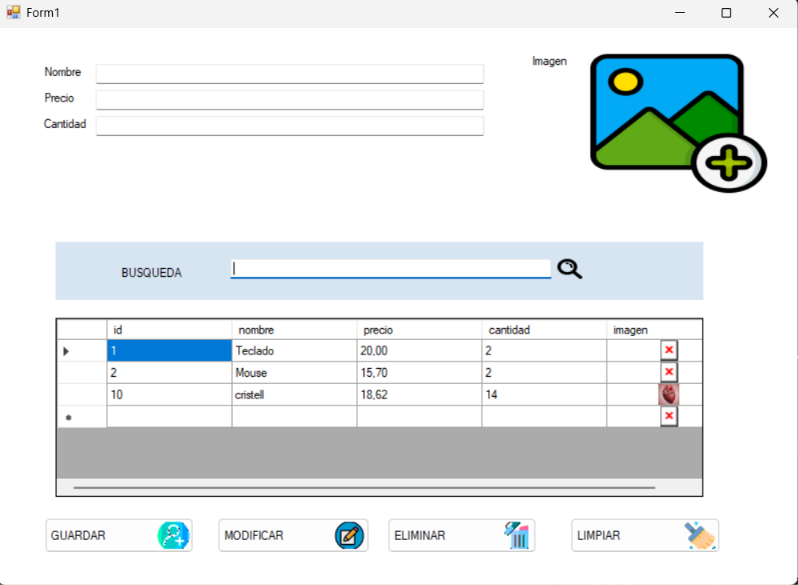
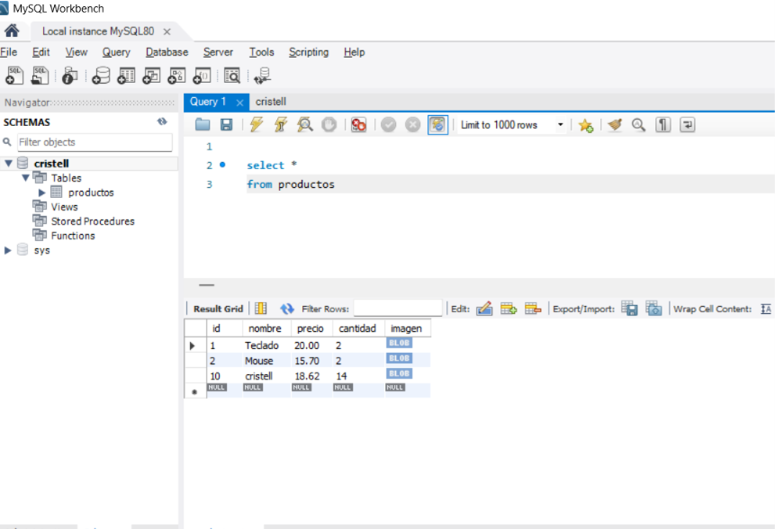
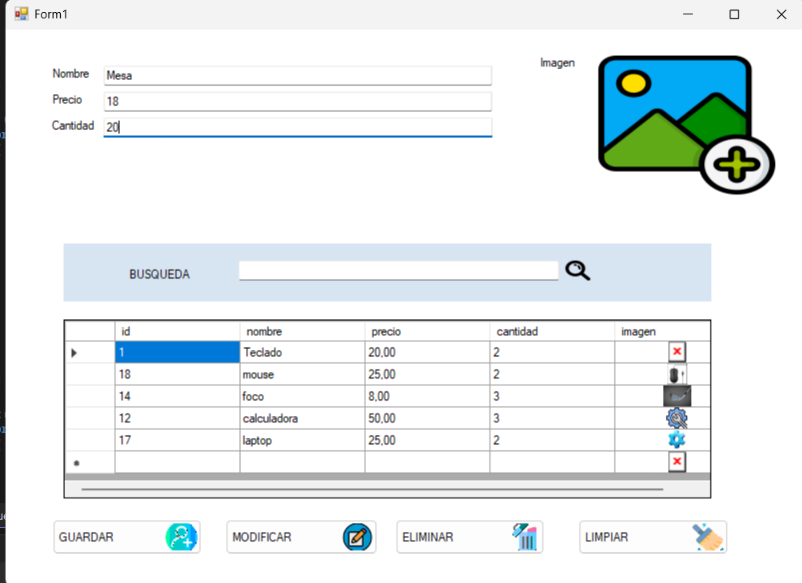
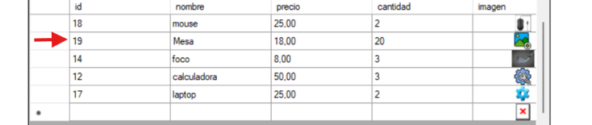
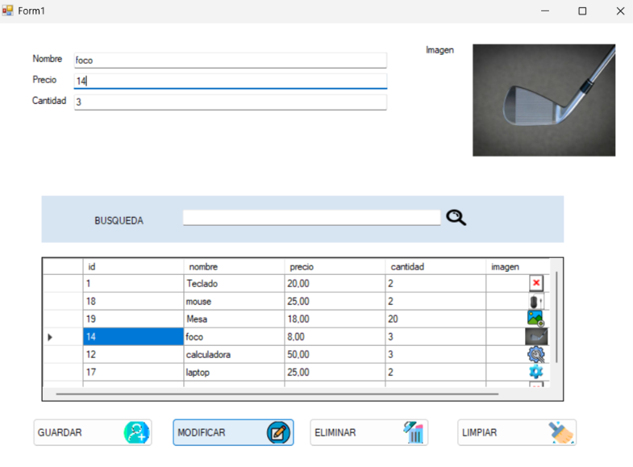
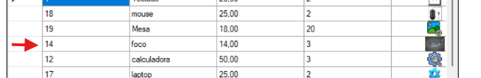
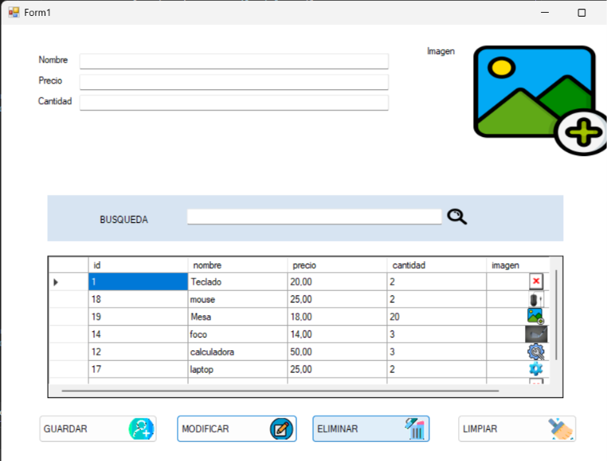
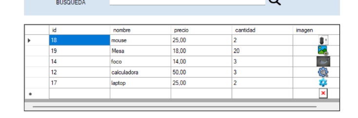
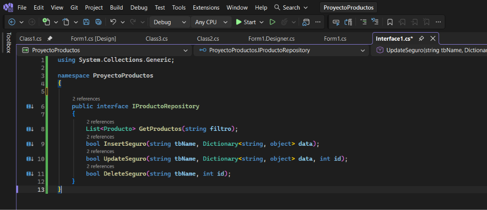

# Laboratorio 4 - HPA3

## Información del laboratorio

| Dato | Información |
|---|---|
| Curso | Herramientas de la Programación Aplicada III (.NET) |
| Laboratorio | #4 |
| Estudiante | Cristell Peters |
| Grupo | 1IL133 |
| Carrera | Ingeniería en Sistemas y Computación |
| Año | 2026 |
| Fecha | 14/09/2026 |
| Instructor | Ing. Irina Fong |

## Objetivos

🩷 Crear una interfaz gráfica en C# Windows Forms que permita ingresar información de productos y sus imágenes.

🩷 Convertir imágenes a arreglos de bytes utilizando `MemoryStream` para poder almacenarlas en una base de datos.

🩷 Conectar la aplicación de C# con MySQL para insertar y cargar registros en un `DataGridView`.

## Contenido del laboratorio

En este laboratorio se desarrolló una aplicación en C# Windows Forms conectada a una base de datos MySQL. El programa permite registrar, consultar, modificar y eliminar productos con información como nombre, precio, cantidad e imagen. También permite seleccionar registros desde un `DataGridView`, realizar búsquedas y limpiar los campos del formulario.

Durante el desarrollo se trabajó con la conexión entre C# y MySQL, el manejo de datos, la conversión de imágenes y las diferentes operaciones necesarias para administrar los productos almacenados en la base de datos.


## Diseño de la aplicación

Primero se diseñó el formulario de la aplicación utilizando Windows Forms. Se agregaron los campos necesarios para ingresar la información de cada producto y controles como el `DataGridView` para mostrar los registros y el `PictureBox` para trabajar con las imágenes.

También se utilizó un `ImageList` para colocar imágenes en algunos de los botones de la aplicación, como guardar, modificar y limpiar.



## Base de datos MySQL

La información de los productos se almacena en una base de datos MySQL. Para este laboratorio se creó una tabla llamada `productos`, que contiene los datos principales de cada producto.

Los campos utilizados son `id`, `nombre`, `precio`, `cantidad` e `imagen`. El campo `imagen` utiliza el tipo `LONGBLOB`, que permite almacenar los datos de la imagen en formato binario.

En C#, este tipo de información se maneja mediante un arreglo de bytes (`byte[]`), lo que permite convertir la imagen para guardarla en la base de datos.



## Conexión entre C# y MySQL

Para conectar la aplicación con MySQL se creó una clase encargada de establecer la conexión con la base de datos. Para esto se utilizó `MySqlConnection` junto con el paquete `MySql.Data`, instalado mediante NuGet.

A partir de esta conexión se pueden realizar consultas y obtener los registros almacenados en la tabla `productos`. También se utilizan `MySqlCommand` para ejecutar instrucciones SQL y `MySqlDataReader` para leer los datos obtenidos.

### 🩷Boton Guardar
Se implementó la funcionalidad del botón GUARDAR, encargado de procesar y registrar la información ingresada en el formulario dentro de la base de datos.

Al hacer clic en este botón, el sistema realiza las validaciones de los campos (comprobando que no haya datos vacíos y que los valores numéricos de precio y cantidad sean válidos). Una vez superadas las validaciones, captura la información de los cuadros de texto junto con la imagen convertida a arreglo de bytes (byte[]) y ejecuta la inserción del nuevo registro en la tabla de productos.

Al finalizar el guardado exitoso, se actualiza automáticamente el DataGridView para reflejar el nuevo producto ingresado y se notifica al usuario mediante un mensaje de confirmación.

Imagenes de Evidencia



Resultado



## Manejo de productos

Los productos se manejan mediante una lista de objetos `Producto`. Los registros obtenidos desde la base de datos se cargan en esta lista y posteriormente se muestran en el `DataGridView`.

Para realizar esta parte se utiliza `List<Producto>` y un método encargado de obtener los productos desde MySQL. También se agregó un filtro de búsqueda que permite consultar los registros utilizando los datos escritos en el campo de búsqueda.

El `DataGridView` permite mostrar los datos de los productos y también las imágenes que se obtienen desde la base de datos.

## Manejo de imágenes

Una de las partes principales del laboratorio fue trabajar con las imágenes de los productos. Para poder almacenarlas en MySQL, primero se convierten en un arreglo de bytes.

Para realizar esta conversión se utiliza `MemoryStream`, que permite trabajar temporalmente con los datos de la imagen en la memoria. De esta manera, la imagen que se encuentra en el `PictureBox` puede convertirse en `byte[]` y luego almacenarse en el campo `LONGBLOB` de la base de datos.

Cuando la imagen se obtiene nuevamente desde MySQL, se realiza el proceso contrario. Los bytes se cargan en un `MemoryStream` y luego se utiliza `Bitmap` para reconstruir la imagen y mostrarla en la aplicación.

## Selección y carga de imágenes

Para seleccionar una imagen desde la computadora se utilizó `OpenFileDialog`. Este componente permite abrir el explorador de archivos de Windows y seleccionar una imagen.

Después de seleccionar el archivo, la imagen se carga en el `PictureBox`, donde puede visualizarse antes de guardar el producto.

También se configuró el filtro del `OpenFileDialog` para trabajar con formatos de imagen como `.jpg`, `.png` y `.bmp`.

# Última modificación del proyecto (21 septiemnbre 2026)

En la última modificación del proyecto se agregaron nuevas funcionalidades para completar el manejo de los productos registrados. Además de guardar productos, ahora la aplicación permite seleccionar un registro desde el `DataGridView`, modificar su información, eliminarlo y limpiar los campos del formulario.

### 🩷Selección de productos

Al hacer clic sobre un producto dentro del `DataGridView`, la información del registro seleccionado se carga automáticamente en los campos del formulario.

Se muestran nuevamente el nombre, precio, cantidad e imagen del producto. También se guarda internamente el `id` del registro seleccionado, lo que permite identificar qué producto se desea modificar o eliminar.

Para realizar esta función se utilizó el evento `CellClick` del `DataGridView`.

### 🩷Botón Modificar

Se agregó la funcionalidad del botón **MODIFICAR**, que permite actualizar la información de un producto que ya se encuentra registrado en la base de datos.

Primero se debe seleccionar un producto desde el `DataGridView`. Luego se pueden cambiar datos como el nombre, precio, cantidad o imagen. Al presionar el botón, se validan nuevamente los datos ingresados y se utiliza el método `UpdateSeguro` para actualizar el registro correspondiente en MySQL.

Después de realizar la modificación, el `DataGridView` se actualiza automáticamente para mostrar los nuevos datos.

Imagenes de Evidencia



Resultado




### 🩷Botón Eliminar

El botón **ELIMINAR** permite borrar un producto seleccionado de la base de datos.

Antes de realizar la eliminación, el programa muestra un mensaje de confirmación utilizando `MessageBox`. Esto permite que el usuario pueda confirmar o cancelar la operación y evita eliminar un producto accidentalmente.

Si se confirma la operación, se utiliza el método `DeleteSeguro` para eliminar el registro de MySQL. Finalmente, se vuelve a cargar la lista de productos para actualizar el `DataGridView`.

Imagenes de Evidencia



Resultado



### 🩷Botón Limpiar

También se agregó la funcionalidad del botón **LIMPIAR**, encargado de dejar nuevamente vacío el formulario.

Al utilizar este botón se limpian los campos de nombre, precio y cantidad. También se restaura la imagen predeterminada del `PictureBox`, se elimina la ruta de la imagen seleccionada anteriormente y se reinicia el producto seleccionado.

Esta funcionalidad permite preparar rápidamente el formulario para ingresar o seleccionar otro producto.

### Actualización del manejo de imágenes

También se realizaron mejoras en el manejo de las imágenes. Cuando se selecciona un producto desde el `DataGridView`, su imagen se muestra nuevamente en el `PictureBox`.

Para convertir las imágenes a `byte[]` se utiliza `MemoryStream`. También se agregó un manejo alternativo para las imágenes seleccionadas directamente desde la computadora, utilizando `File.ReadAllBytes`. Esto ayuda a evitar problemas durante la conversión y almacenamiento de las imágenes.

Las imágenes mostradas dentro del `DataGridView` se configuran con el modo `Zoom`, permitiendo visualizar la imagen completa dentro de su celda.


# Última modificación del proyecto - Implementación de Interfaz- 5/10/2026

En esta actualización se agregó una interfaz llamada `IProductoRepository`, utilizada como contrato para definir las operaciones principales que se realizan con los productos.

## 🩷Creación de la Interfaz

Para agregar la interfaz en Visual Studio se realizaron los siguientes pasos:

1. Clic derecho sobre el proyecto `ProyectoProductos`.
2. Seleccionar `Agregar`.
3. Seleccionar `Nuevo elemento`.
4. Seleccionar `Interfaz`.
5. Colocar como nombre `IProductoRepository.cs`.

La interfaz creada contiene los métodos que deberá implementar la clase encargada de trabajar con la base de datos.

```csharp
using System.Collections.Generic;

namespace ProyectoProductos
{
    public interface IProductoRepository
    {
        List<Producto> GetProductos(string filtro);
        bool InsertSeguro(string tbName, Dictionary<string, object> data);
        bool UpdateSeguro(string tbName, Dictionary<string, object> data, int id);
        bool DeleteSeguro(string tbName, int id);
    }
}
```




## 🩷Cambios en `Conexion.cs`

La clase `Conexion` fue modificada para implementar la interfaz `IProductoRepository`.

Antes:

```csharp
public class Conexion
```

Ahora:

```csharp
public class Conexion : IProductoRepository
```

También se eliminó `static` de los métodos:

```csharp
GetProductos()
InsertSeguro()
UpdateSeguro()
DeleteSeguro()
```

Esto permite trabajar con una instancia de la clase `Conexion` mediante la interfaz.

## 🩷Cambios en `Form1.cs`

Dentro de `Form1.cs` se agregó una variable de tipo `IProductoRepository`:

```csharp
private IProductoRepository conexionRepo;
```

Luego se crea la conexión dentro del constructor:

```csharp
public Form1()
{
    InitializeComponent();
    conexionRepo = new Conexion();
}
```

Las llamadas anteriores se realizaban directamente desde la clase `Conexion`.

Por ejemplo:

```csharp
Conexion.InsertSeguro(...);
Conexion.UpdateSeguro(...);
Conexion.DeleteSeguro(...);
Conexion.GetProductos(...);
```

Ahora se realizan utilizando `conexionRepo`:

```csharp
conexionRepo.InsertSeguro(...);
conexionRepo.UpdateSeguro(...);
conexionRepo.DeleteSeguro(...);
conexionRepo.GetProductos(...);
```

## 🩷Diferencia entre el código anterior y el nuevo

| Aspecto | Antes | Ahora |
|---|---|---|
| Conexión | `Form1` dependía directamente de `Conexion` | `Form1` trabaja mediante `IProductoRepository` |
| Métodos | Se utilizaban métodos `static` | Se utilizan métodos de instancia |
| Insertar | `Conexion.InsertSeguro()` | `conexionRepo.InsertSeguro()` |
| Modificar | `Conexion.UpdateSeguro()` | `conexionRepo.UpdateSeguro()` |
| Eliminar | `Conexion.DeleteSeguro()` | `conexionRepo.DeleteSeguro()` |
| Consultar | `Conexion.GetProductos()` | `conexionRepo.GetProductos()` |
| Acoplamiento | Mayor acoplamiento con `Conexion` | Menor acoplamiento mediante la interfaz |
| Mantenimiento | Más difícil realizar cambios | Más fácil reemplazar o modificar la conexión |

## 🩷Funcionamiento de la Interfaz

La estructura utilizada ahora es:

```text
Form1
  ↓
IProductoRepository
  ↓
Conexion
  ↓
MySQL
```

`Form1` utiliza la interfaz `IProductoRepository`, mientras que la clase `Conexion` se encarga de implementar los métodos necesarios para trabajar con la base de datos.

De esta manera, el formulario no depende directamente de la implementación de `Conexion`, sino del contrato establecido por la interfaz.


## Futuras actualizaciones

Como futura mejora del proyecto se plantea agregar un formato predeterminado para la información antes de almacenarla en la base de datos.

Actualmente, el nombre de un producto se guarda de acuerdo con la forma en que el usuario lo escriba. Por ejemplo, puede introducir información utilizando mayúsculas, minúsculas o diferentes combinaciones de ambas.

En una futura actualización se busca normalizar estos datos antes de guardarlos, de manera que todos los registros mantengan un formato uniforme. Esto permitiría controlar aspectos como mayúsculas y minúsculas, espacios innecesarios y el tratamiento de caracteres con tilde.

Con esta mejora se busca mantener la información de la base de datos más organizada y consistente, independientemente de la forma en que el usuario escriba los datos en el formulario.

## Herramientas utilizadas

🩷 C#

🩷 Windows Forms

🩷 .NET

🩷 MySQL

🩷 MySQL Workbench

🩷 Visual Studio

🩷 NuGet / MySql.Data

🩷 DataGridView

🩷 PictureBox

🩷 OpenFileDialog

🩷 MemoryStream
